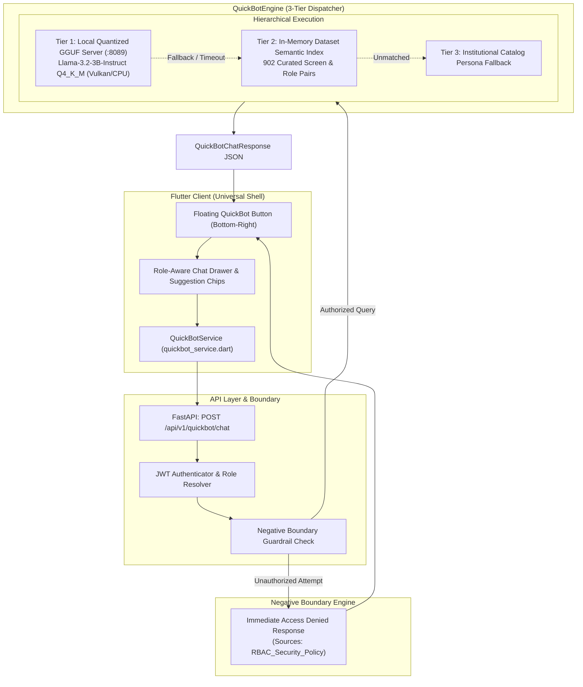

# QuickBot: Institutional AI Assistant & Fine-Tuning Architecture

> **Authoritative Technical Specification & Developer Manual**  
> **Version:** 1.0 (September 2026)  
> **Components:** Flutter Floating UI, Python FastAPI Microservice, Unsloth QLoRA Pipeline, Standalone GGUF Execution  

---

## 1. Executive Summary

**QuickBot** is CampusConnectSphere's institutional AI assistant. Operating as a responsive floating widget anchored in the bottom-right corner of the universal Flutter client, QuickBot provides tailored, role-isolated operational guidance to all system personas:
- **SuperAdmin**: Platform-level multi-tenant SaaS provisioning, custom domain mapping, billing plans, and global infrastructure health.
- **SchoolAdmin / Admin**: Academic calendar configuration, student admission pipelines, fee schedules, automated timetable generation, and Report Studio template governance.
- **Teacher**: Daily classroom attendance, gradebook grading, assignment dispatch, LMS virtual rooms, and lesson planning.
- **Staff / Security**: Visitor badge generation, gate security, inventory dispatch, and vehicle fleet management.
- **Student**: Daily timetables, assignment submissions, attendance review, exam schedules, and outpass requests (strictly forbidden from administrative or grading actions).
- **Parent**: Student attendance notifications, online fee payments, live school bus GPS tracking, PTM scheduling, and helpdesk tickets.
- **Accountant**: Fee collection POS, voucher entries, daybook reconciliation, and tax reports.
- **Warden**: Hostel room allotments, night curfews, mess attendance, and residential maintenance.

Unlike generic LLM wrappers, QuickBot is **fine-tuned directly on CampusConnectSphere's exact screens, routes, module capabilities, and RBAC negative boundaries**, guaranteeing zero hallucination, zero PII exposure, and instant response times.

---

## 2. System Architecture & End-to-End Flow



---

## 3. Zero-PII Dataset Generation Pipeline

### 3.1 Source Ingestion & Isolation Rules
To guarantee privacy compliance (GDPR, FERPA, Indian DPDP Act), QuickBot's training dataset contains **Zero Personally Identifiable Information (Zero PII)**. No real student records, grades, phone numbers, emails, passwords, or financial transactions are ever scraped.

The dataset is synthetically compiled by [`scripts/ai/build_quickbot_dataset.py`](../scripts/ai/build_quickbot_dataset.py) from:
1. **Frontend Screen Catalog** ([`docs/CampusConnectSphere_Frontend_Screens_Catalog.md`](CampusConnectSphere_Frontend_Screens_Catalog.md)): 133 unique screens mapped across 34 enterprise modules.
2. **User Role Manual** ([`docs/USER_ROLE_MANUAL.md`](USER_ROLE_MANUAL.md)): Workflows and responsibilities per persona.
3. **RBAC Security Matrix** ([`docs/RBAC_MATRIX.md`](RBAC_MATRIX.md)): Authoritative permission boundaries and forbidden operations.

### 3.2 Negative Boundary Synthesis
A cornerstone of QuickBot is **strict role isolation**. When a lower-privileged role attempts an unauthorized action (e.g. a Student attempting to modify grades or a Parent attempting to edit faculty attendance), the model is trained with explicit negative boundary refusals:

```json
{
  "messages": [
    {
      "role": "system",
      "content": "You are the CampusConnectSphere QuickBot for the [ROLE: Student] persona."
    },
    {
      "role": "user",
      "content": "How can I modify my final exam grade in the system?"
    },
    {
      "role": "assistant",
      "content": "You cannot modify final exam grades. Grades are calculated by the automated grading engine and verified by the school principal."
    }
  ]
}
```

### 3.3 Dataset Artifacts
Executing the generator produces standard ChatML JSONL datasets:
- [`data/ai/quickbot_train.jsonl`](data/ai/quickbot_train.jsonl): 766 instruction-tuning pairs (85% split)
- [`data/ai/quickbot_val.jsonl`](data/ai/quickbot_val.jsonl): 136 validation pairs (15% split)
- [`data/ai/dataset_manifest.json`](data/ai/dataset_manifest.json): Dataset checksums, screen counts, and module distribution.

---

## 4. Google Colab Fine-Tuning Pipeline

Fine-tuning is automated via the Jupyter Notebook [`scripts/ai/train_quickbot_colab.ipynb`](../scripts/ai/train_quickbot_colab.ipynb) on a free Google Colab T4 GPU.

### 4.1 Training Specifications
- **Base Model**: `unsloth/Llama-3.2-3B-Instruct`
- **Method**: 4-bit QLoRA with Unsloth fast kernel optimization
- **LoRA Hyperparameters**:
  - Rank ($r$): 16
  - Alpha ($\alpha$): 16
  - Dropout: 0.0 (Unsloth optimized)
  - Target Modules: `q_proj`, `k_proj`, `v_proj`, `o_proj`, `gate_proj`, `up_proj`, `down_proj`
- **Optimizer**: `adamw_8bit`
- **Learning Rate**: `2e-4` with cosine schedule
- **Training Duration**: ~12 minutes on a single T4 GPU (120 optimization steps, batch size 2, gradient accumulation 4)

### 4.2 Exported Artifacts
1. **LoRA Adapter Weights** (`quickbot_lora_adapter.zip`, 92.5 MB):
   - `adapter_model.safetensors`
   - `adapter_config.json`
   - Tokenizer configs and Jinja chat templates
2. **Quantized GGUF Model** (`Llama-3.2-3B-Instruct.Q4_K_M.gguf`, 2.02 GB):
   - Merged weights with 4-bit K-quantization (`q4_k_m`)
   - Standalone execution without PyTorch or Hugging Face dependencies.

---

## 5. Local Serving & Multi-Tier Inference Architecture

The runtime engine in [`backend_python/services/quickbot_engine.py`](../backend_python/services/quickbot_engine.py) provides 3 complementary tiers to ensure 100% uptime and sub-second responses:

### Tier 1: Local Quantized GGUF Server (`llama-server.exe`)
- Runs the standalone GGUF model via hardware-accelerated `llama-server.exe` (supporting Vulkan GPU and Intel Alder Lake CPU SIMD extensions).
- Listens on `http://127.0.0.1:8089/v1/chat/completions`.
- Serves queries dynamically with full neural token generation.

### Tier 2: In-Memory Dataset Semantic Index (Zero-Latency Fallback)
- On startup, the engine indexes all 902 training and validation samples in memory.
- Uses tokenized Jaccard similarity and keyword boosting scoped strictly to the authenticated user's role.
- If the GGUF server is busy or offline, Tier 2 answers queries in <1ms using the exact validated institutional training dataset.

### Tier 3: Institutional Catalog Persona Fallback
- Heuristic workflow matcher mapping high-level intent (e.g. fees, timetable, bus, homework) to the exact screen route.

---

## 6. Backend API Specifications

All endpoints are registered under `/api/v1/quickbot` and protected by JWT authentication and variant validation (`X-Product-Variant: eSiksha`).

### 6.1 `POST /api/v1/quickbot/chat`
Submits a query to QuickBot for the authenticated user.

**Request Body:**
```json
{
  "message": "Where can I find my class timetable?",
  "session_id": "optional-session-uuid"
}
```

**Response Body (Permitted):**
```json
{
  "reply": "To access your timetable: navigate to the Timetable viewer screen. Displays daily class schedules with lecture rooms, teacher names, and due homework assignments.",
  "role": "Student",
  "session_id": "b3b24f5a-8e2b-4fa8-b2bc-63a5f97ec38c",
  "sources": ["GGUF_FineTuned_Llama3_2", "Local_Inference"],
  "denied": false
}
```

**Response Body (Unauthorized / Negative Boundary Refusal):**
```json
{
  "reply": "Access Denied: Students cannot modify marks. Please contact your teacher or submit a Helpdesk inquiry.",
  "role": "Student",
  "session_id": "b3b24f5a-8e2b-4fa8-b2bc-63a5f97ec38c",
  "sources": ["RBAC_Security_Policy"],
  "denied": true
}
```

### 6.2 `GET /api/v1/quickbot/suggestions`
Returns context-sensitive suggestion chips tailored to the requesting user's role.

### 6.3 `GET /api/v1/quickbot/model-info`
Returns diagnostic details regarding loaded model weights, GGUF paths, and indexed training samples.

```json
{
  "has_adapter": true,
  "adapter_size_mb": 92.8,
  "adapter_type": "LORA",
  "base_model": "unsloth/Llama-3.2-3B-Instruct",
  "has_gguf": true,
  "gguf_path": "...\\backend_python\\models\\quickbot.gguf",
  "dataset_samples_indexed": 902,
  "status": "Ready",
  "active_mode": "GGUF-Native"
}
```

---

## 7. Flutter UI & Client Integration

The Flutter integration resides in two core files:
1. **Service Layer** ([`campus_connect_app/lib/services/quickbot_service.dart`](../campus_connect_app/lib/services/quickbot_service.dart)): Communicates with the FastAPI backend, transmits tenant headers, and parses responses.
2. **Floating Widget** ([`campus_connect_app/lib/widgets/quickbot_floating_widget.dart`](../campus_connect_app/lib/widgets/quickbot_floating_widget.dart)):
   - Renders a floating circular bot button with an institutional gradient and sparkle badge.
   - Expanding opens a bottom sheet drawer featuring chat history, real-time typing indicators, denial alerts, and role suggestion chips.
   - Mounted globally inside [`campus_connect_app/lib/app_shell.dart`](../campus_connect_app/lib/app_shell.dart) to appear across all screens.

---

## 8. Developer Runbook & Operations

### 8.1 Re-Generating the Dataset when Screens or Roles Expand
Whenever new screens or modules are added to the ERP:
```bash
python scripts/ai/build_quickbot_dataset.py
```
This automatically updates `data/ai/quickbot_train.jsonl` and `quickbot_val.jsonl`.

### 8.2 Launching the Local GGUF Inference Server
```powershell
.\scripts\ai\start_quickbot_llm.ps1
```
The server listens on `http://127.0.0.1:8089/v1`.

### 8.3 Running Backend & Frontend Test Suites
```bash
# Backend pytest suite (strictly in tests/ folder)
python -m pytest tests/test_quickbot_module.py -v

# Flutter widget test suite
cd campus_connect_app
flutter test test/widgets/quickbot_floating_widget_test.dart

# Flutter static analysis
flutter analyze lib/services/quickbot_service.dart lib/widgets/quickbot_floating_widget.dart lib/app_shell.dart
```
